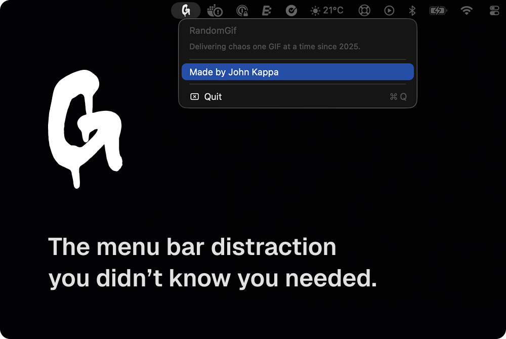
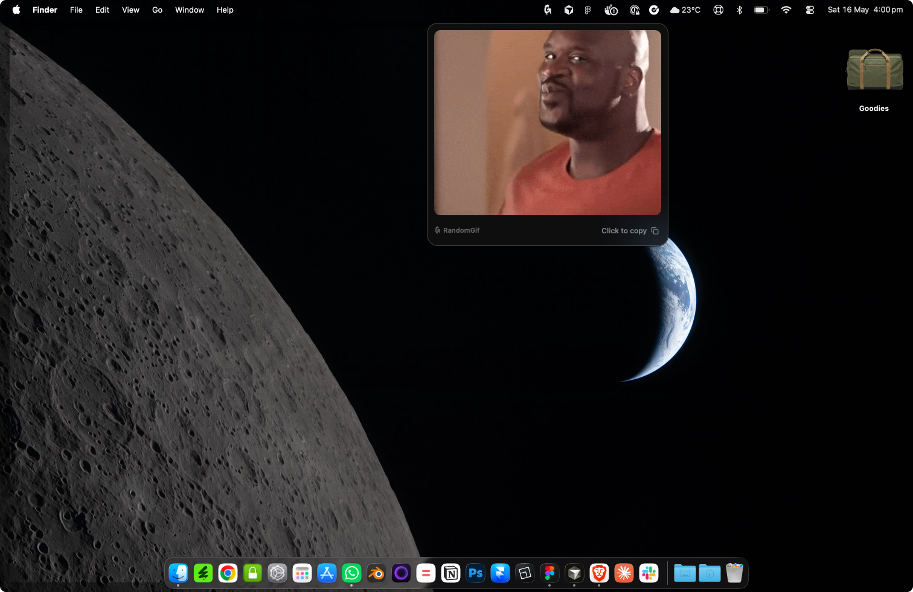

# RandomGif


A macOS menu bar app that serves up random animated GIFs on demand. Click the icon in your menu bar, get a GIF, click it to copy to your clipboard.






Made by [John Kappa](https://johnkappa.com)

---

## Download

**[⬇ Download RandomGif-1.0.10.dmg](https://github.com/j-kappa/random_gif/releases/latest/download/RandomGif-1.0.10.dmg)**

Requires **macOS 13 (Ventura)** or later. Universal binary — works on Apple Silicon and Intel Macs.

---

## Install

> **Never installed a DMG before? Start here.**

1. **Download** the `.dmg` file using the link above
2. **Open** it — a window appears with the RandomGif icon and an Applications folder shortcut
3. **Drag** RandomGif into Applications
4. **Eject** the disk image (drag it to Trash, or press ⌘E)
5. Open **Finder → Applications**, find RandomGif, and double-click it

**macOS will warn you** the first time because the app isn't from the App Store. This is normal for independently distributed apps. To open it anyway:

- Right-click RandomGif in Applications and choose **Open**, then click **Open** again in the dialog

If that doesn't work, open Terminal and run:

```bash
xattr -cr /Applications/RandomGif.app
open /Applications/RandomGif.app
```

RandomGif lives in the **menu bar** (top-right of your screen). There's no Dock icon — look for the GIF logo up top.

---

## Updates

RandomGif checks for updates automatically when you launch it. If a new version is available, a blue **"Update Available — vX.X ↗"** item will appear in the right-click menu. Clicking it opens this page so you can download the latest DMG.

You can always see your current version number in the right-click menu next to the app name.

---

## Usage

| Action | What happens |
|---|---|
| **Left-click** the menu bar icon | Shows a random GIF |
| **Click the GIF** | Copies it to your clipboard |
| **Click anywhere else** | Dismisses the GIF |
| **Right-click** the menu bar icon | Opens the menu (credits, update check, quit) |

---

## Features

- Lives in the menu bar — no Dock icon, no window clutter
- Custom GIF logo in the menu bar
- Fetches random GIFs from Reddit, Giphy, random.dog, and The Cat API
- Preloads the next GIF in the background for instant display
- Click the GIF to copy it to your clipboard (file URL + raw GIF data)
- Click anywhere else to dismiss
- Right-click menu shows the current version and any available updates
- Smooth UI with vibrancy, rounded corners, and loading states

---

## Build from Source

> For developers. Requires Xcode Command Line Tools (`xcode-select --install`).

```bash
git clone https://github.com/j-kappa/random_gif.git
cd random_gif
cp .env.example .env        # add your Giphy API key (optional — see below)
./run.sh
```

This builds a universal binary (arm64 + x86_64), installs it to `~/Applications/RandomGif.app`, and launches it.

### Giphy API Key (Optional)

To enable Giphy as a GIF source, get a free key at [developers.giphy.com](https://developers.giphy.com), then:

```bash
cp .env.example .env
# edit .env and set: GIPHY_API_KEY=your_actual_key_here
```

Without a key the app still works using Reddit, random.dog, and The Cat API.

### Create a DMG

Requires Python 3 and Pillow:

```bash
python3 -m venv .venv
source .venv/bin/activate
pip install pillow
python3 make_dmg.py
```

Output goes to `dist/RandomGif-1.0.10.dmg`.

---

## How It Works

The app picks a random GIF source from a weighted pool (Reddit 3×, Giphy 2×, dog 1×, cat 1×), downloads the image data, and renders it in a WebKit view using a custom `giflocal://` URL scheme handler — no double-download, no temp files for display. When you click the GIF, it writes both a temporary file URL and the raw GIF pasteboard type so pasting works in most apps.

On launch it silently calls the GitHub Releases API to compare the latest release tag against the installed version. If a newer version exists, the right-click menu surfaces an update prompt.

---

## Project Structure

```
Package.swift                # SPM manifest (macOS 13+, no dependencies)
Info.plist                   # App bundle metadata
Sources/RandomGif/
  main.swift                 # App entry point
  AppDelegate.swift          # Menu bar icon, right-click menu, update prompt
  GifFetcher.swift           # Reddit, Giphy, dog, and cat API fetchers
  GifPreloader.swift         # Background preload actor
  GifWindowController.swift  # Panel UI, WebKit view, clipboard, branding
  UpdateChecker.swift        # GitHub Releases version check
  Secrets.swift              # Generated from .env (git-ignored)
run.sh                       # Build universal binary + install + sign
make_dmg.py                  # Create styled DMG for distribution
make_icon.py                 # Procedural icon generator
icon.png                     # Custom app icon source
GIF.svg                      # Menu bar icon SVG
.env.example                 # Template for API keys
```

---

## GIF Sources

| Source | Weight |
|---|---|
| Reddit (gif-focused subreddits, `/hot` JSON) | 3× |
| Giphy (requires API key) | 2× |
| random.dog | 1× |
| The Cat API | 1× |
